# INET

INET — адаптивная система веб-исследований на Python, LangGraph и React с фокусом на **бесплатное исследование сети вместо обязательной зависимости от платных аналогов**. Она ищет информацию, читает страницы, выбирает резервные сервисы, экономит квоты и развивает собственные адаптеры через изолированную разработку и испытания.

Интерфейс включает поиск с источниками, карту реальных запросов, каталог инструментов, состояние системы и лабораторию автоматизации. Исходное [видение проекта](VISION.md) сохранено. [JSON-каталог](backend/resources.json) содержит 114 исходных ссылок с описаниями, категориями, метаданными и происхождением. Обнаруженные инструменты и обновлённые сведения хранятся в runtime-БД и доступны в интерфейсе.

Пользователь выбирает только один из двух режимов — **«Поиск»** или **«Глубокое исследование»**. После ответа диалог можно продолжать уточняющими вопросами: они сохраняют контекст и источники ветки, а несколько отправленных вопросов выполняются строго по очереди. Фоновая рефлексия при этом не блокирует чат. Готовый результат выгружается в Markdown и Unicode PDF прямо с экрана ответа.

«Карта запросов» показывает не журнал, а фактические маршруты: отдельно для каждого поискового запроса или URL видна упорядоченная цепочка использованных движков, fetch/parsing-инструментов, их статус и длительность. Справа остаётся обычный хронологический журнал событий с раскрываемыми подробностями. Если фоновая рефлексия смогла прочитать источник, недоступный во время основного прогона, на ответе появляется предупреждение `!` и кнопка **«Улучшить ответ»**, запускающая новое полноценное исследование с уже накопленными улучшениями.

## Free-first: открытые проекты, бесплатные API и trial-квоты

INET агрегирует open-source проекты, бесплатные API, публичные feeds и бесплатные пробные квоты, а затем проверяет их в реальной работе. Маршрутизатор сначала использует локальные и бесплатные способы — официальные endpoints, HTTP, RSS/JSON-LD, curl_cffi, Jina Reader, SearXNG и браузеры — и обращается к настроенному платному сервису только как к дополнительному fallback. Бесплатный trial тоже считается бесплатным ресурсом, но хранится как конечная квота: после её исчерпания система переключается на другие инструменты, а не скрыто создаёт расходы.

Настойчивость регулируется в интерфейсе ползунком 1–4. Уровень 1 использует четыре стандартных маршрута (`official`, HTTPX, `curl_cffi`, Jina), уровни 2 и 3 расширяют бюджет до 6 и 8 разных способов, а уровень 4 перебирает **все доступные способы**: structured endpoints, desktop и mobile HTTP, browser-TLS HTTP, Trafilatura, Readability, Jina Reader, Playwright, режим ожидания селектора, браузерный агент и подключённые адаптеры. После полного перебора уровень 4 проектирует и live-тестирует новый parsing pipeline; если способов меньше десяти, запускает discovery дополнительного бесплатного инструмента. Выполнение прекращается раньше, если достоверное содержимое уже получено — лишние запросы ради счётчика не отправляются.

После готового ответа может автоматически запускаться отдельная **рефлексия**: ответ уже доступен пользователю, а агент ниже на той же странице анализирует трассу и отказы, пробует альтернативные pipelines и сохраняет только прошедшие live-проверку улучшения. Её можно выключить либо выбрать глубину 1–4: от анализа трассы без изменений до восьми экспериментов и поиска новых бесплатных инструментов. Ход рефлексии виден в реальном времени, его можно остановить и запустить повторно.

| Настройки настойчивости и рефлексии | Рефлексия под готовым ответом |
| --- | --- |
| 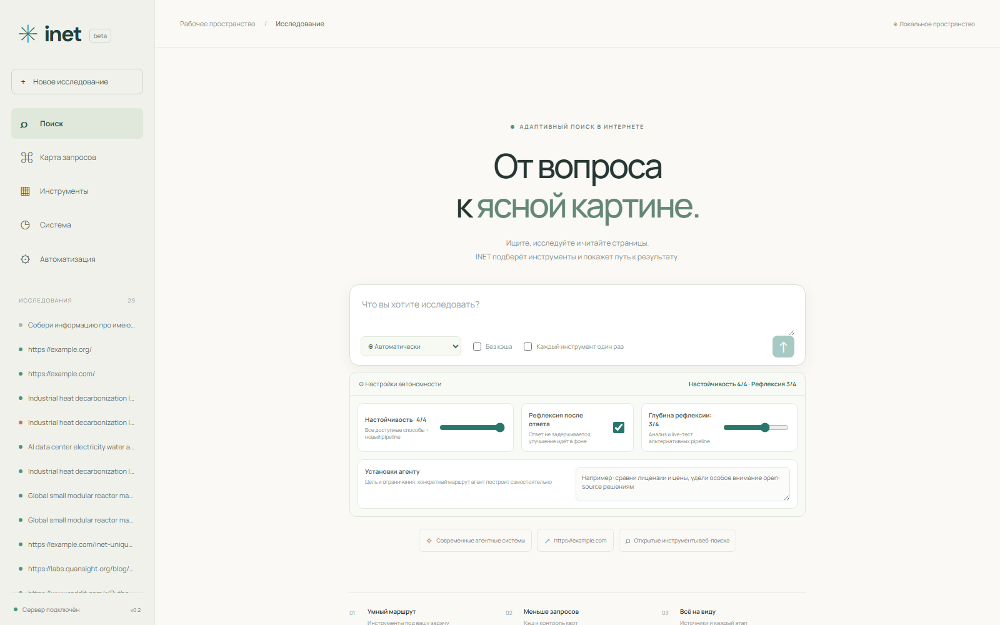 | 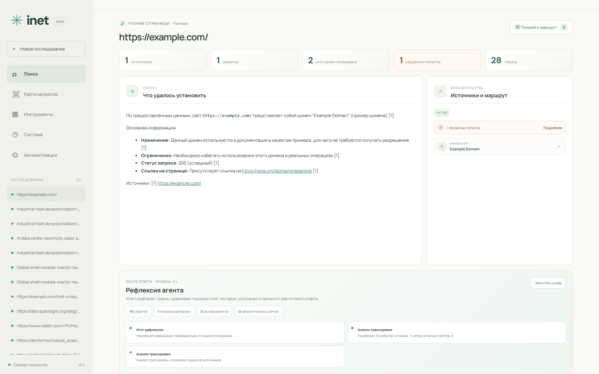 |

Каталог не заявляет, что каждый найденный проект уже безопасен или работоспособен. Он непрерывно пополняется через GitHub/API discovery; кандидат становится активным только после проверки лицензии и стоимости, запуска в изолированной песочнице, contract-теста и live-gate. Так INET может собирать доступные бесплатные решения из сети, не исполняя случайный код прямо в основном backend.

Новые проверенные кандидаты каталога:

- [untidetect-tools](https://github.com/TheGP/untidetect-tools) — источник кандидатов по браузерной приватности, humanizing, proxy и fingerprint testing; внутри смешаны бесплатные и платные решения, поэтому каждый элемент проверяется отдельно.
- [Stealth Browser MCP](https://github.com/vibheksoni/stealth-browser-mcp) — MIT MCP-сервер для Chrome/CDP, DOM и сетевой диагностики.
- [Camoufox](https://github.com/daijro/camoufox) — MPL-2.0 Firefox/Playwright browser engine; сам проект предупреждает, что абсолютной неотслеживаемости не существует.
- [Open News](https://github.com/alphap365/open-news) — MIT Python toolkit для новостей, Google News, RSS discovery, извлечения, дедупликации и ранжирования.
- [Obscura](https://github.com/h4ckf0r0day/obscura) — Apache-2.0 Rust browser с CDP и Docker; заявленные проектом показатели памяти и скорости требуют собственного benchmark перед продвижением.
- [Search1API](https://s1.dev) — коммерческий search/crawl API со 100 бесплатными стартовыми кредитами без карты; в каталоге обозначен как `free_trial`, а не безлимитный бесплатный сервис.

Anti-detect и браузерные инструменты предназначены для доступа к открытым данным, повышения приватности и тестирования собственных систем. INET не гарантирует обход CAPTCHA, авторизации, платного доступа или правил сайта и сохраняет SSRF-защиту, доменные ограничения, лимиты ресурсов и аудит действий.

## Интерфейс и реальные исследования

### Глубокие исследования по десяткам сайтов

Режим «Глубокое исследование» сначала передаёт агенту цель и необязательные пользовательские установки. Агент до первого обращения к поисковику сам формирует и приоритизирует поисковые задачи, выбирает порядок движков, оценивает выдачу, назначает дополнительные запросы для обнаруженных пробелов, решает, какие URL действительно открыть, и задаёт порядок parsing-инструментов для каждой ссылки. Программный план используется только как резерв при недоступности модели. Результаты дедуплицируются по URL и доменам, после чего система действительно читает выбранные сайты и строит обзор по извлечённым доказательствам.

На одно исследование действует общий жёсткий лимит **120 вызовов**. В него входят решения модельного планировщика, поисковые движки, чтение страниц, создание новых pipelines и эксперименты рефлексии. Текущий расход `N/120` виден в интерфейсе; после достижения лимита новые вызовы не выполняются. Fallback-пулы не являются фиксированным сценарием: агент определяет исходный порядок, а накопленная успешность, задержка, cooldown и новые ошибки позволяют менять его во время работы.

| Тема | Прочитано | Домены | Найдено |
| --- | ---: | ---: | ---: |
| Мировой рынок и развёртывание малых модульных реакторов | 32 | 30 | 37 |
| Декарбонизация промышленного тепла | 24 | 21 | 40 |
| Энергия, вода и сети для AI-дата-центров | 32 | 30 | 48 |

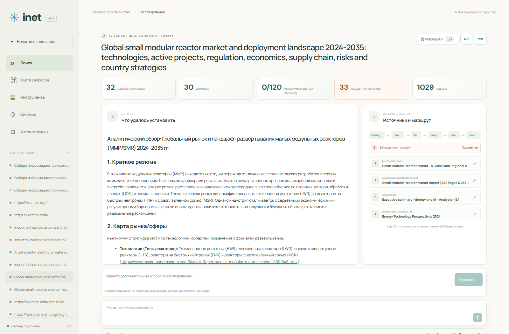

| Декарбонизация промышленного тепла | Инфраструктура AI-дата-центров |
| --- | --- |
| 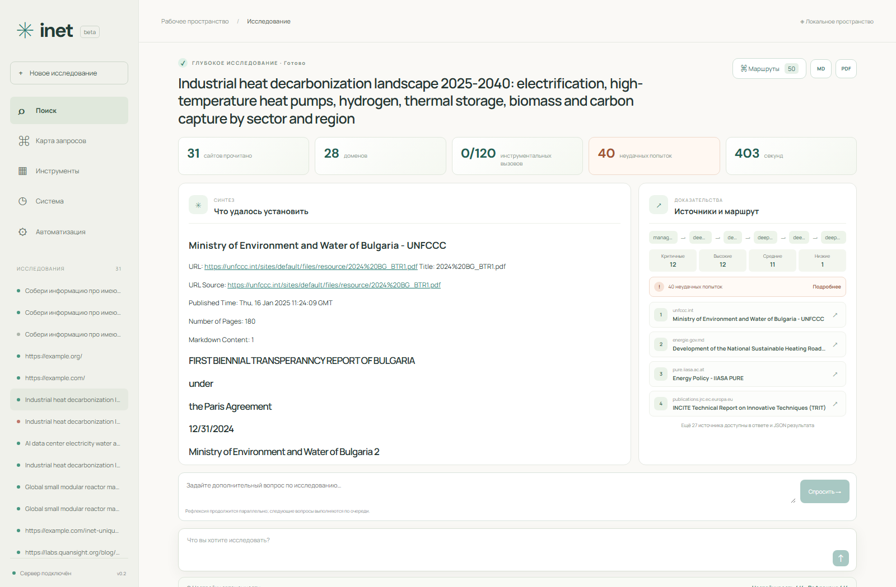 | 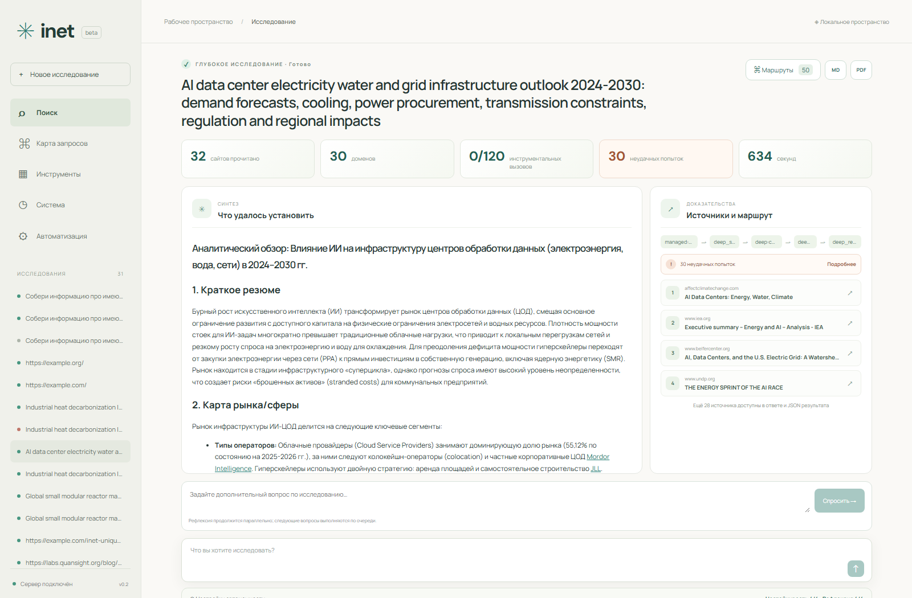 |

[Раскрытая диагностика 30 неудачных попыток](artifacts/deep-research-20260924/04-ai-datacenter-failures.png) и [карта deep-маршрута](artifacts/deep-research-20260924/05-deep-research-route.png) показывают фактические действия агента. Полные ответы, URL, извлечения и события сохранены в `artifacts/deep-research-20260924/results.json`.

Во время выполнения интерфейс в реальном времени показывает текущую операцию, запрос или URL, имя и назначение инструмента, его endpoint, длительность и последние переходы. Источники ранжируются как критичные, высокие, средние и низкие, а фактический бюджет задаётся выбранной настойчивостью. На уровне 4 для непрочитанного сайта агент дополнительно проектирует и испытывает новый parsing pipeline. Аварийные задачи ремонта получают приоритет над плановым обслуживанием, а отказавший управляемый SearXNG перезапускается и проверяется повторно.

| Агент в реальном времени | Проверка приоритетного обхода |
| --- | --- |
| 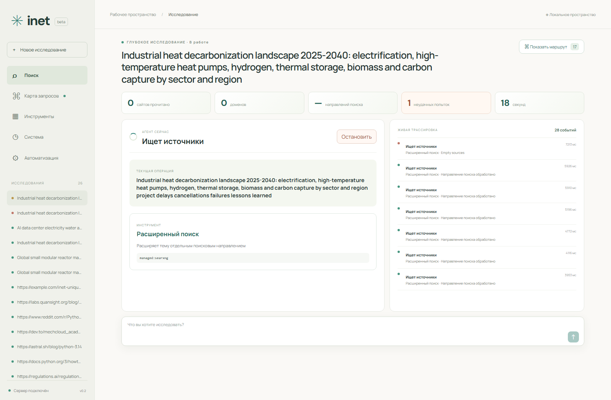 | 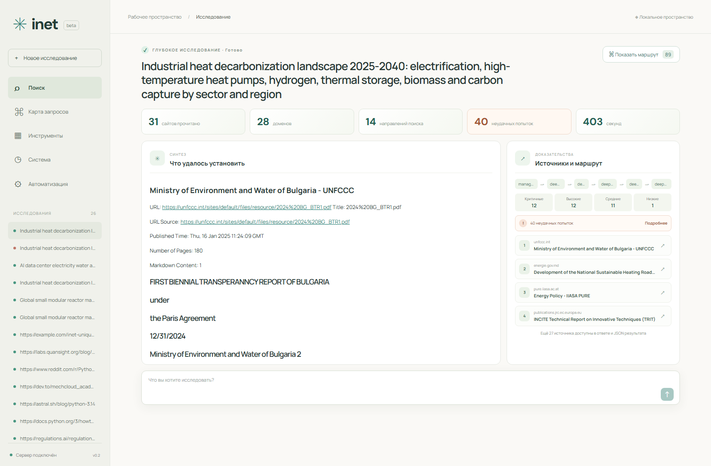 |

Повторный большой тест декарбонизации промышленного тепла прочитал 31 из 36 выбранных сайтов на 28 доменах. Зафиксированы 40 неудачных попыток отдельных инструментов и 5 непрочитанных сайтов; три критичных источника получили по 7 попыток, один высокоприоритетный — 6, один средний — 4. Использовались SearXNG, HTTPX, curl_cffi, Jina Reader, Playwright, браузерный агент, official-endpoint и автоматически спроектированные pipelines. Полная трасса сохранена в `artifacts/deep-research-20260924/retry-industrial-heat-decarbonization.json`.

Результат исследования собран в один экран: синтез ответа, покрытие источников, использованные маршруты и ссылки для проверки. На живом acceptance-прогоне система провела три многоисточниковых исследования, получила 30 результатов с 19 доменов, успешно выполнила 14 из 14 углублённых чтений и 8 из 8 сценариев парсинга. Проверялись обычный HTML, JSON API, RSS, JSON-LD и страница с браузерным fallback.

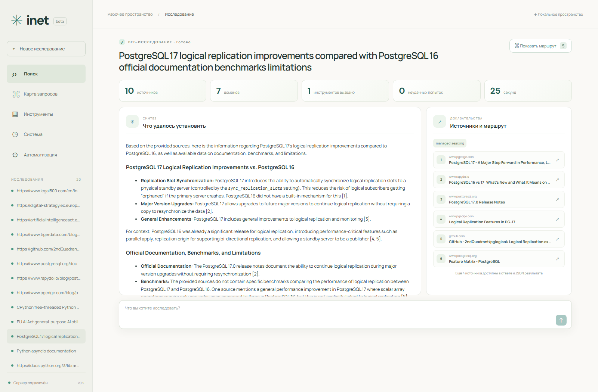

| Наблюдаемость маршрута | Автономные пайплайны |
| --- | --- |
| 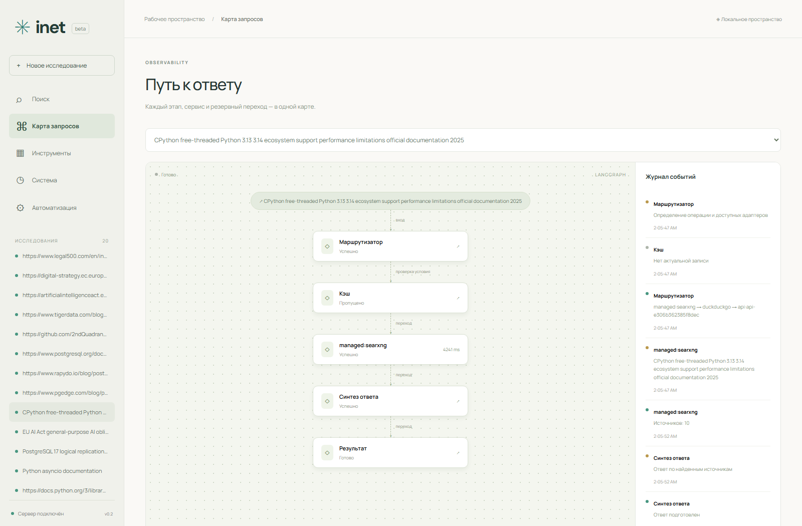 | 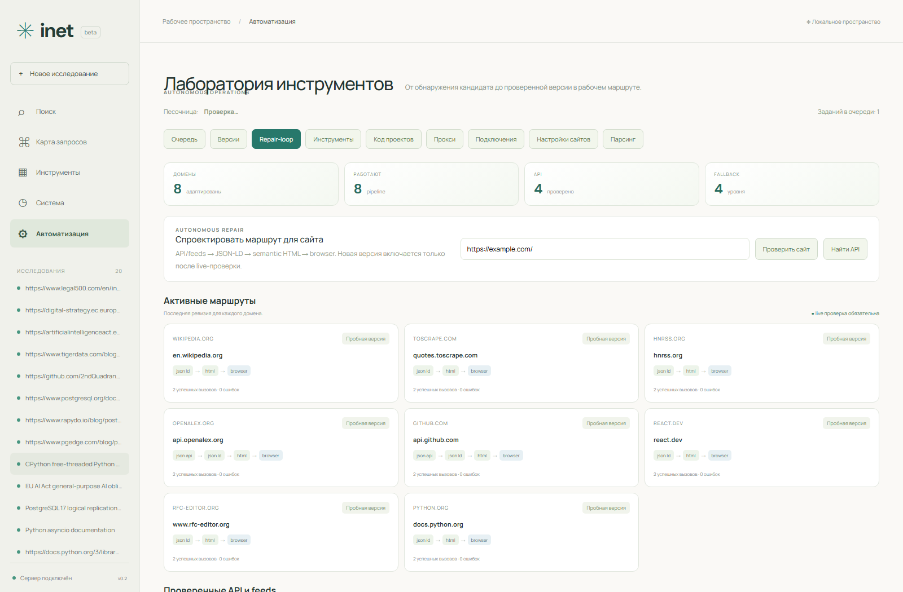 |

Дополнительные экраны исследований [EU AI Act](artifacts/network-research-20260924/02-eu-ai-act-research.png) и [free-threaded CPython](artifacts/network-research-20260924/03-cpython-research.png), а также [очередь автономных операций](artifacts/network-research-20260924/06-operations.png) сохранены вместе с воспроизводимыми JSON-результатами. Это проверенный набор сайтов, а не обещание доступа ко всему интернету: CAPTCHA, платные Firecrawl/Tavily, прокси и Wayback в данном прогоне не понадобились.

Режим **«Каждый инструмент один раз»** запрещает повторный вызов адаптера в пределах одного исследования. В живой проверке `curl_cffi` и HTTPX получили 404, после чего Jina Reader завершил чтение; интерфейс показывает две неудачные попытки, их действия, URL, причины и длительность.

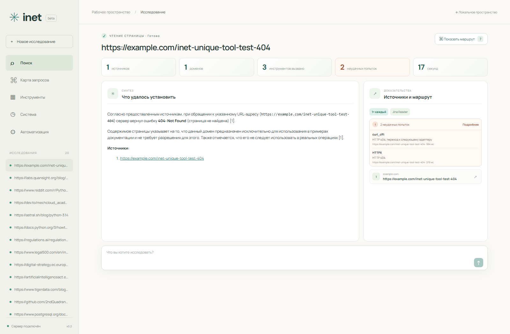

## Функциональность

| Контур | Реализация |
| --- | --- |
| Search | Управляемый SearXNG по требованию, DuckDuckGo HTML, Tavily, пользовательские API и проверенные плагины |
| Fetch | Официальные RSS/Atom/sitemap/JSON/JSON-LD и alternate links; HTTPX, curl_cffi, Jina, Playwright, Firecrawl, прокси, плагины |
| Архив | Wayback Availability API и чтение снимка, только при `allow_archive=true` |
| Браузер | Headless, ожидание селектора, агент на Playwright: чтение, переходы внутри домена, безопасные клики, ожидание, прокрутка |
| CAPTCHA | Детектирование страниц проверки; опциональные интеграции CapSolver/2Captcha для виджетов Turnstile/reCAPTCHA v2 с sitekey и callback |
| Маршрутизация | LangGraph: план, попытки, резервные переходы, восстановление, синтез и результат |
| Кэш | TTL 30 минут; отрицательный TTL 60 секунд; дедупликация активных запросов; ключ учитывает архив, инструкцию, модель, политики и версии |
| Квоты | Атомарное резервирование кредитов, месячные бюджеты, удалённые остатки, `Retry-After`/cooldown при 429 и 503 |
| Память | Успешность и задержка по доменам, перенос общего рейтинга, история сбоев, междоменные паттерны, версии правил |
| Discovery | GitHub API с резервом через рабочие поисковые адаптеры, метаданные репозиториев, лицензия, актуальность и источник сведений |
| Разработка | LLM читает README кандидата, создаёт/исправляет Python-адаптер, фиксирует зависимости и сохраняет ревизию с parent/diff/digest |
| Песочница | Одноразовый Docker-контейнер: непривилегированный пользователь, read-only root, лимиты CPU/RAM/PID/времени, без ключей и host mounts |
| Управляемые инструменты | Постоянные контейнерные сервисы с декларативной конфигурацией, health-check, лимитами CPU/RAM/PID, метриками, watchdog-перезапуском и ручным stop/restart |
| Испытания | Fetch: 20 детерминированных сценариев и 20 независимых публичных сайтов. Search: 20 эталонных запросов |
| Продвижение | Только после испытаний; canary, активация после 5 успехов, откат при регрессии, автоматическая постановка исправления в очередь |
| Прокси | Обнаружение, фильтрация публичных IP, проверка HTTPS CONNECT/TLS и контрольного содержимого, TTL и выбор по задержке |
| Парсинг | Сохраняемые планы до 50 страниц, CSS-поля, переходы внутри доменов, расписание, JSON/CSV-экспорт |
| Repair-loop | Версионируемые цепочки JSON API/feed → JSON-LD → semantic HTML → browser, live-gate, диагностика этапов, canary и автоматический откат |
| Бесплатные API | Поиск API/feeds со страницы или поисковым запросом, проба без ключа, генерация ConnectorSpec, реальный contract-test и включение только после успеха; тариф и лицензия не выдумываются |
| Ключи | Встроенные сервисы и произвольные API через UI, шифрование Fernet, ключи не возвращаются клиенту |
| Фоновые задачи | Персистентная FIFO-очередь, восстановление после перезапуска, обновление метаданных/квот/документации по расписанию |
| Наблюдаемость | Отдельный граф последовательных маршрутов по каждому запросу/URL; линейный журнал, реальные попытки, сервисные URL, прокси, задержки, ошибки, jobs, отчёты испытаний, diff и аудит версий |
| Диалог и экспорт | Продолжение исследования с контекстом, FIFO-очередь вопросов параллельно рефлексии, повторный прогон после восстановления источника, Markdown и Unicode PDF |

Автоматическая оплата и регистрация аккаунтов не выполняются: VISION прямо оставляет покупку сервисов на будущее. Добавление API-ключей и уже оплаченных API реализовано.

## Запуск полного комплекта

Нужны Docker Engine с Linux-контейнерами и Compose v2. Сборка включает Chromium и может занять несколько минут.

```powershell
Copy-Item .env.example .env
# Заполните модель и необходимые ключи в .env.
docker compose up --build
```

- Интерфейс: http://localhost:8501
- API/Swagger: http://localhost:8000/docs
- Локальная песочница: http://localhost:8090/health

Compose запускает backend, frontend/Nginx, sandbox service, egress proxy, эталонный сервер и собирает `inet-sandbox-runtime:local` и `inet-sandbox-workspace:local`. SearXNG поднимается агентом по требованию. Песочница получает только внутреннюю Docker-сеть `inet-sandbox`; выход наружу идёт через egress proxy с проверкой и фиксацией публичного IP. Внутреннее исключение — сервер эталонов. Только доверенный sandbox service имеет Docker socket; backend и исполняемый код его не получают.

Если доступные поисковые адаптеры исчерпаны, агент разворачивает SearXNG через sandbox control plane и повторяет исходный запрос. Другие серверные инструменты описываются полем `service` в `AdapterSpec`; библиотеки устанавливаются в одноразовый контейнер из фиксированных `package==version` зависимостей.

## Редактирование проектов и движков

В разделе «Код проектов» агент может подключить публичный HTTPS Git-репозиторий на конкретной ревизии либо создать дерево из начальных файлов. Проект хранится в отдельном Docker volume, а не в файловой системе backend. Доступны обход дерева, чтение файлов, полные записи, удаления, unified diff, команды без shell, snapshots и rollback. Команды ограничены CPU, RAM и PID; сеть выключена по умолчанию и при явном включении проходит только через egress proxy.

Задание `workspace_repair` принимает имя проекта и описание сбоя. Модель получает ограниченный набор релевантных текстовых файлов, предлагает минимальную правку и argv-команды проверки. Перед изменением создаётся snapshot. При провале любой проверки файлы автоматически откатываются. Если проект связан с управляемым сервисом, после успешных тестов сервис перезапускается и проходит readiness-check; при ошибке развёртывания также выполняется rollback. Конфигурационные файлы управляемых движков автоматически переводятся в такой редактируемый проект при provisioning.

Связь исходников с сервисом задаётся парой `ManagedProjectSpec.service` и `ManagedServiceSpec.project/project_dir`. Корень контейнера остаётся read-only; в него монтируется только volume конкретного проекта. Проект не получает Docker socket, host mounts или секреты backend.

Runtime-БД, контрольные точки и ключ шифрования сохраняются в volume `runtime_data`. Не удаляйте `master.key`, иначе сохранённые секреты нельзя будет расшифровать. Для собственного управления ключом задайте `INET_MASTER_KEY` — корректный Fernet key. Порты привязаны к loopback; приложение рассчитано на локальное пространство одного пользователя.

## Модель и автоматизация

Программные search/fetch, кэш, квоты и ручное управление работают без LLM. Для автономной разработки новых адаптеров, интеллектуального восстановления и браузерного агента требуется настроенная модель:

```dotenv
ENABLE_LLM=true
AI_PROVIDER=ollama
AI_MODEL=qwen3:8b
OLLAMA_BASE_URL=http://host.docker.internal:11434
```

Модель должна быть установлена в Ollama и поддерживать структурированные ответы. Также доступны `openai_compatible`, `openai`, `anthropic`, `google`, `groq`, `deepseek` через [models.py](backend/models.py). Ключи этих LLM задаются в `.env`; инструменты Tavily, Firecrawl, CapSolver, 2Captcha и произвольные API можно подключать через интерфейс.

`ENABLE_AUTOMATION=true` включает периодические discovery, обновление метаданных, сверку квот и документации API, drift-check активных pipelines и повторную проверку обнаруженных API. Период — `MAINTENANCE_INTERVAL` секунд, по умолчанию 3600. Первый запуск планировщика — через минуту. Без модели discovery пополняет каталог; генерация явно сообщает о недостающей настройке, не подменяя результат заглушкой.

После провала базового маршрута агент анализирует ошибки и память домена, проверяет структурированные endpoints, проектирует декларативный pipeline и выполняет его на исходном URL. Рабочая ревизия сохраняется для домена. Runtime-регрессия ставит `pipeline_repair` в очередь; новая версия проходит live-gate, работает как canary и откатывается при повторных ошибках. Если этого недостаточно, агент проверяет прокси, управляемые инструменты и изолированные Python-адаптеры. Работа ограничена бюджетами, таймаутами и числом ревизий, а не обещанием получить доступ к любому сайту.

## Работа в интерфейсе

1. Введите вопрос или URL. Для устаревших материалов можно отдельно разрешить Wayback.
2. Откройте карту: там видны реальные попытки, включая повторное использование того же сервиса.
3. В каталоге нажмите «Разработать адаптер» либо запустите discovery в разделе «Автоматизация».
4. В «Версиях» доступны код, изменения, отчёт испытаний, проверка, продвижение и откат.
5. В `Repair-loop` можно заранее проверить источник, увидеть созданные ступени и API, доступ к которым действительно прошёл без ключа.
6. В «Подключениях» сохраните ключ или JSON-конфигурацию собственного API.
7. В «Настройках сайтов» задайте CSS-селекторы извлекаемых полей, таймауты и официальные URL.
8. В «Парсинге» сохраните план, запустите сбор или задайте интервал не менее 300 секунд. Выгрузите результат в JSON/CSV.

Заявления исходного каталога о бесплатности не используются как рабочие лимиты. Для неизвестного API сначала подтверждается ответ без ключа, затем модель строит только декларативное отображение полей. Endpoint принудительно остаётся наблюдавшимся, секретные static-параметры запрещены, а connector включается лишь после реального запроса и проверки выходного контракта. Локальные бюджеты задаются оператором. Firecrawl синхронизируется через официальный credit-usage endpoint; у пользовательского API можно задать `usage_endpoint` и `remaining_path`. Документация API отслеживается по URL и digest. Система не выдумывает тарифы, если провайдер не предоставляет счётчик.

## Разработка без контейнеров

```powershell
python -m venv .venv
.venv\Scripts\python -m pip install -r backend/requirements-dev.txt
.venv\Scripts\python -m playwright install chromium
Copy-Item .env.example .env
.venv\Scripts\python -m uvicorn main:app --app-dir backend --env-file .env --host 127.0.0.1 --port 8000
```

В другом терминале:

```powershell
cd frontend
npm.cmd ci
npm.cmd start
```

Frontend: http://localhost:3000, proxy: `127.0.0.1:8000`. Для локального браузера включите `ENABLE_BROWSER=true` и `ENABLE_CURL=true`. Для локального Ollama используйте `http://localhost:11434`. Песочницу можно поднять отдельно командой `docker compose up --build sandbox`; управляемый SearXNG будет создан автоматически при необходимости. Для внешнего уже существующего экземпляра задайте `SEARXNG_URL`.

## API

```http
POST /api/runs
Content-Type: application/json

{"query":"https://example.com","mode":"auto","limit":5,"fresh":false,"allow_archive":false,"instruction":""}
```

Ответ `202` содержит run ID. `search` возвращает `sources[{url,title,snippet}]`, `fetch` — `content,status,final_url,sources` и при наличии `structured`, `entries`, `extracted`, `browser_steps`.

| Метод | Путь | Назначение |
| --- | --- | --- |
| GET | `/health`, `/api/system` | Состояние runtime и адаптеров |
| GET / POST | `/api/runs` | История / создание запроса |
| GET | `/api/runs/{id}` | События и результат |
| POST | `/api/runs/{id}/cancel`, `/resume` | Отмена и возобновление |
| GET | `/api/resources`, `/api/control` | Каталог и лаборатория |
| POST | `/api/jobs` | discovery/generation/evaluation, managed services, API discovery, pipeline design/evaluation/repair, crawl |
| POST | `/api/projects` | Создать/подключить редактируемый проект |
| GET | `/api/projects/{name}/file?path=...` | Прочитать файл проекта |
| POST | `/api/projects/{name}/mutate`, `/command`, `/rollback/{snapshot}` | Изменить, проверить или откатить проект |
| POST | `/api/versions`, `/api/versions/{id}/promote`, `/rollback` | Ревизии адаптеров |
| POST | `/api/pipelines`, `/api/pipelines/{id}/evaluate` | Декларативные parsing pipelines и live-gate |
| POST | `/api/keys`, `/api/connectors` | Секреты и API-контракты |
| POST | `/api/policies`, `/api/proxies/sources`, `/api/crawls` | Правила, источники прокси, планы сбора |
| GET | `/api/datasets/{id}?format=json\|csv` | Выгрузка данных |

## Проверка и устройство

```powershell
.venv\Scripts\python -m pytest backend -q
npm.cmd --prefix frontend run build
.venv\Scripts\python scripts/browser_smoke.py
.venv\Scripts\python scripts/live_providers.py
```

[Архитектура](docs/architecture.md) описывает границы доверия, очередь и продвижение версий. [Отчёт проверки](docs/verification.md) отделяет пройденные проверки от интеграций, для которых нужны внешний сервис или ключи.

Наличие кода интеграции не означает доступность каждого внешнего сервиса, успешное прохождение любой CAPTCHA или работоспособность всех кандидатов. Неисправные кандидаты остаются отклонёнными/заблокированными и не попадают в рабочий маршрут.
