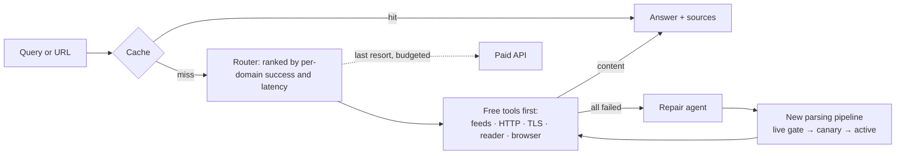

<div align="center">


# INET

**Free-first, self-healing web research engine for people and AI agents.**
A self-hosted alternative to paid search and scraping APIs (Tavily, Firecrawl, Perplexity API).

**English** · [Русский](README.ru.md) · [简体中文](README.zh-CN.md)

[](https://github.com/JGSnapp/inet/actions/workflows/ci.yml)
[](LICENSE)


<sub>Deep research: 12 minutes compressed to 40 seconds · [MP4](docs/assets/demo.mp4)</sub>

</div>

## What it does

Ask a question or paste a URL. INET searches, reads pages and answers with citations, **using free
sources first**: public search engines, official feeds and APIs, plain HTTP, browser-TLS HTTP, reader
services and a headless browser. A paid API is touched only as the last fallback, within a budget you set.

When a site cannot be read, INET does not just give up. It records why, tries the next method,
designs a new parsing pipeline for that domain, tests it on the live page and keeps it only if it works.

- **Search, fetch, deep research.** A quick search takes seconds. Deep research lets an agent plan
  queries, pick sources and read dozens of sites before it writes a sourced report.
- **Free-first router with memory.** Tools are ranked by success rate and latency per domain.
  Results are cached, and quotas are reserved atomically, so you never pay twice for one request.
- **Self-healing.** Failed sources get versioned repair pipelines with live gates, canary rollout and automatic rollback.
- **Transparent.** A route map shows every tool that was called for every query and URL, with timings and errors.
- **Plugs into your stack.** It ships an MCP server for Claude Code, Cursor and Cline, plus a Python SDK, LangChain tools, a CLI
  and Tavily- and Firecrawl-compatible endpoints.
- **Any LLM, or none.** Search and fetch work without a model. For answers, use Ollama or any
  OpenAI-compatible endpoint, or OpenAI, Claude, Gemini, Groq or DeepSeek.
- **English and Russian UI.** Events, errors and exports follow the language of the interface; answers follow the language of the question.
- **Safe by design.** Generated code runs only in a locked-down Docker sandbox. SSRF protection is on,
  keys are encrypted, and everything binds to localhost.

## Quick start

**Linux / macOS**

```bash
curl -fsSL https://raw.githubusercontent.com/JGSnapp/inet/main/install.sh | sh
cd ~/inet && ./inet setup && ./inet serve --open
```

**Windows (PowerShell)**

```powershell
irm https://raw.githubusercontent.com/JGSnapp/inet/main/install.ps1 | iex
cd ~\inet; .\inet setup; .\inet serve --open
```

The installer brings its own Python through [uv](https://docs.astral.sh/uv/), so there is nothing
else to install first. `inet setup` asks which LLM to use; you can skip it and run without one.
Open http://127.0.0.1:8000 to use the UI, or http://127.0.0.1:8000/docs for the API.

<details>
<summary><b>Docker Compose</b> (full stack with the adapter sandbox)</summary>

```bash
git clone https://github.com/JGSnapp/inet && cd inet
cp .env.example .env        # set ENABLE_LLM / AI_* and a random SANDBOX_TOKEN
docker compose up --build
```

The UI runs at http://localhost:8501 and the API at http://localhost:8000. For Ollama on the host, set
`OLLAMA_BASE_URL=http://host.docker.internal:11434`.
</details>

<details>
<summary><b>Manual install</b></summary>

```bash
python -m venv .venv && .venv/bin/pip install -r backend/requirements-browser.txt -e "sdk/python[mcp]"
.venv/bin/python -m playwright install chromium
npm --prefix frontend ci && npm --prefix frontend run build
cp .env.example .env && ./inet serve
```
</details>

## Use it

### Command line

```bash
inet search "free-threaded Python 3.14 status"
inet fetch https://peps.python.org/pep-0703/
inet ask "SQLite vs DuckDB for analytics" --deep
inet doctor                       # check dependencies and the LLM connection
```

`search`, `fetch` and `ask` start the server in the background if it is not already running.

### MCP: Claude Code, Claude Desktop, Cursor, Cline, Windsurf

Three tools are exposed: `web_search`, `fetch_url` and `research` (with `deep=true` for multi-site reports).

```bash
claude mcp add inet -- ~/inet/inet mcp               # Claude Code (Windows: C:\Users\you\inet\inet.cmd mcp)
```

```json
{
  "mcpServers": {
    "inet": { "command": "/home/you/inet/inet", "args": ["mcp"] }
  }
}
```

If you run INET in Docker or on another machine, use the standalone client instead:

```json
{
  "mcpServers": {
    "inet": {
      "command": "uvx",
      "args": ["--from", "inet-client[mcp] @ git+https://github.com/JGSnapp/inet#subdirectory=sdk/python", "inet-mcp"],
      "env": { "INET_URL": "http://127.0.0.1:8000" }
    }
  }
}
```

### Python SDK and LangChain

```bash
pip install "inet-client[langchain] @ git+https://github.com/JGSnapp/inet#subdirectory=sdk/python"
```

```python
from inet_client import Inet

with Inet() as inet:                                  # $INET_URL or http://127.0.0.1:8000
    hits = inet.search("vector databases benchmark 2026")["sources"]
    page = inet.fetch("https://example.com")["content"]
    report = inet.research("Open-source Perplexity alternatives", deep=True)["answer"]

from inet_client.langchain import inet_tools          # web_search, fetch_url, research
agent = create_react_agent(model, inet_tools())
```

### Replace Tavily or Firecrawl

Point an existing client at INET. Any API key the client sends is accepted and ignored.

| Endpoint | Compatible with |
| --- | --- |
| `POST /tavily/search` | Tavily `/search` (`query`, `max_results`, `include_answer`) |
| `POST /firecrawl/v1/scrape` | Firecrawl `/v1/scrape` (markdown) |
| `POST /api/search`, `/api/fetch`, `/api/research` | Simple blocking JSON API |
| `POST /api/runs` + `GET /api/runs/{id}` | Async runs with the full event trace |

## How it works


```mermaid
flowchart LR
  Q[Query or URL] --> C{Cache}
  C -->|hit| A[Answer + sources]
  C -->|miss| R[Router: ranked by per-domain success and latency]
  R --> T[Free tools first:<br/>feeds · HTTP · TLS · reader · browser]
  T -->|content| A
  T -->|all failed| H[Repair agent]
  H --> P[New parsing pipeline<br/>live gate → canary → active]
  P --> T
  R -.->|last resort, budgeted| $[Paid API]
```

**Persistence level** (1–4) sets how many different methods INET may try per source. Level 4 tries
every available method, then designs a new pipeline. **Reflection** runs after the answer is shown:
it replays failures, tests alternatives and keeps only improvements that pass a live check.

| Deep research answer | Route map: every tool call per query and URL |
| --- | --- |
|  |  |
| **Live agent activity** | **Catalog of free tools** |
|  |  |

More detail: [architecture](docs/architecture.md) (trust boundaries, sandbox, repair loop).

## Built-in tools

| Stage | Tools |
| --- | --- |
| Search | DuckDuckGo, DDGS metasearch, Wikipedia, SearXNG (self-hosted or auto-started in Docker), Tavily (optional) |
| Fetch | Official RSS/Atom/JSON/JSON-LD, HTTPX (desktop and mobile), curl_cffi with browser TLS, Trafilatura, Readability, Jina Reader, Playwright, a browser agent, Wayback (opt-in), Firecrawl (optional) |
| Self-repair | Declarative parsing pipelines, API discovery, generated adapters tested in the sandbox against 20 fixtures and 20 live sites |
| Operations | Quota budgets, 429/503 cooldowns, proxy discovery and verification, scheduled crawls with JSON/CSV export |

The [catalog](backend/resources.json) lists 112 free and free-tier tools with provenance. A tool is
enabled only after its license, cost and live behavior are checked.

## Configuration

Everything is set in `.env`; `inet setup` covers the common cases. Key settings:

| Variable | Meaning |
| --- | --- |
| `ENABLE_LLM`, `AI_PROVIDER`, `AI_MODEL`, `AI_BASE_URL`, `AI_API_KEY` | Model for answers and agents (`ollama`, `openai_compatible`, `openai`, `anthropic`, `google`, `groq`, `deepseek`) |
| `ENABLE_CURL`, `ENABLE_BROWSER` | Browser-TLS HTTP and headless Chromium fallbacks |
| `SEARXNG_URL` | Your own SearXNG instance |
| `TAVILY_API_KEY`, `FIRECRAWL_API_KEY` + `*_MONTHLY_LIMIT` | Optional paid fallbacks with a hard monthly budget |
| `AGENT_MESSAGE_LIMIT`, `TOOL_CALL_LIMIT`, `RUN_TIMEOUT` | Budgets for one research run |
| `INET_LANG` | Message language for the API and background jobs (`en` or `ru`); the UI follows the browser, `?lang=ru` switches it |

## Responsible use

INET reads **public** information. It does not bypass logins, paywalls or site terms, and it does not
report CAPTCHA or error pages as content. CAPTCHA-solving services and proxies are optional integrations
that you must configure yourself. INET is a local single-user service; do not expose it publicly
without authentication. See [SECURITY.md](SECURITY.md).

## Contributing

Bug reports, sites that INET cannot read, new free tools and translations are welcome. See
[CONTRIBUTING.md](CONTRIBUTING.md).

## License

[MIT](LICENSE)
