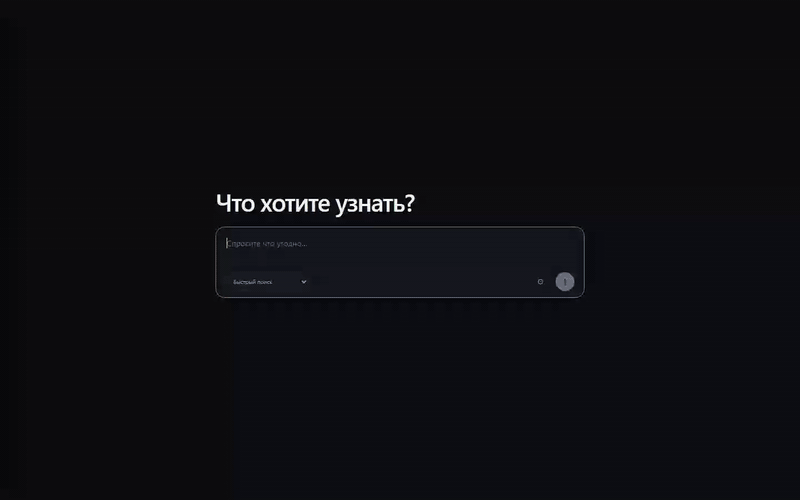
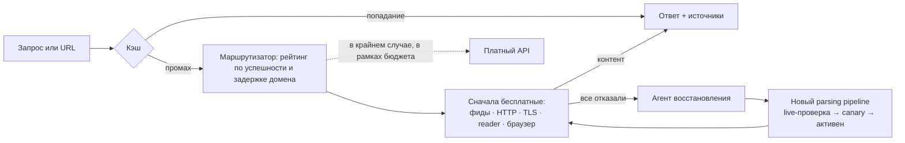
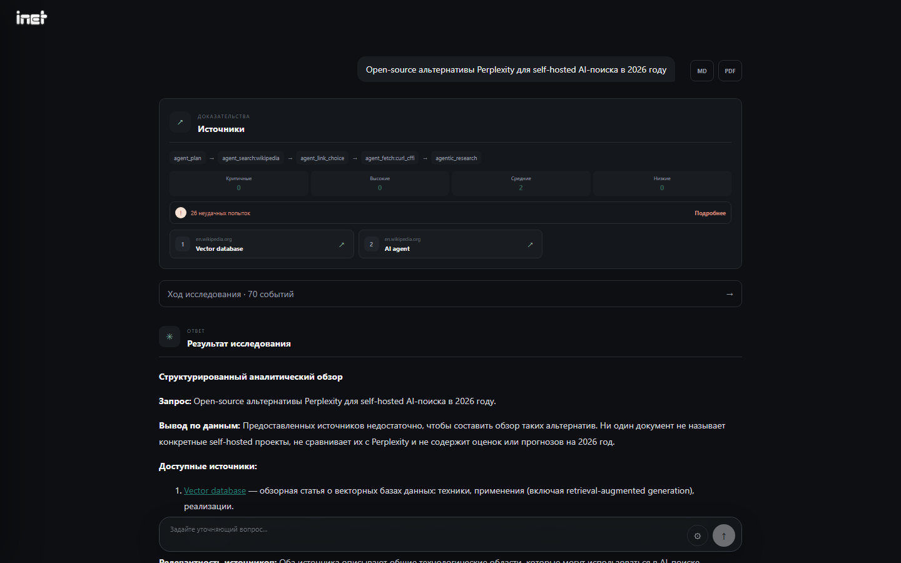
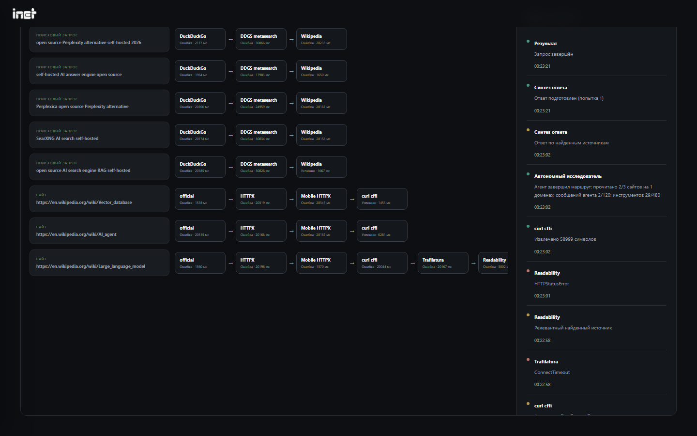
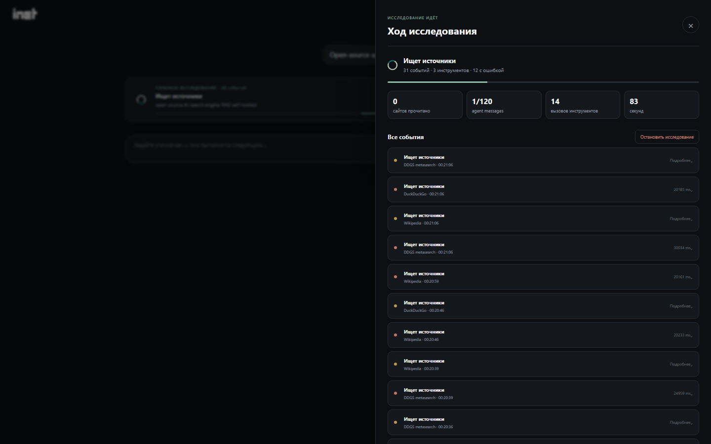
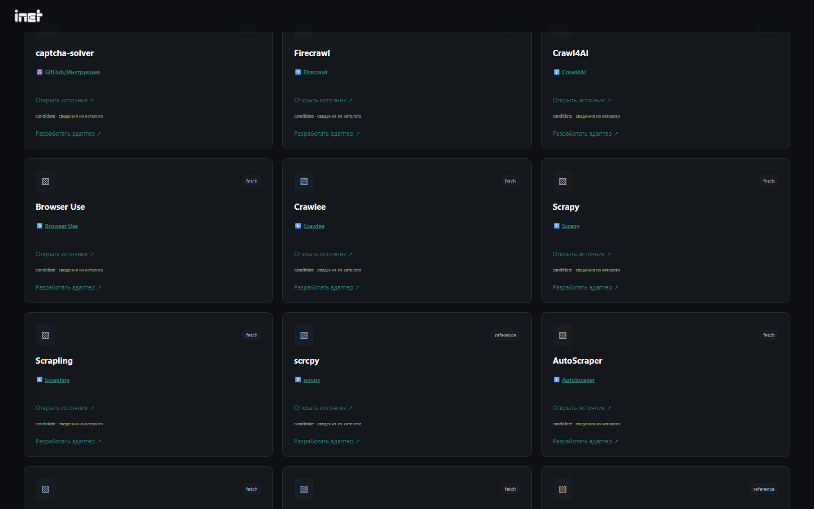

<div align="center">


# INET

**Бесплатный в первую очередь, самовосстанавливающийся движок веб-исследований для людей и AI-агентов.**
Self-hosted альтернатива платным API поиска и парсинга (Tavily, Firecrawl, Perplexity API).

[English](README.md) · **Русский** · [简体中文](README.zh-CN.md)

[](https://github.com/JGSnapp/inet/actions/workflows/ci.yml)
[](LICENSE)




<sub>Глубокое исследование: 4 минуты, сжатые до 35 секунд · [MP4](docs/assets/demo-ru.mp4)</sub>

</div>

## Что это

Задайте вопрос или вставьте URL. INET ищет, читает страницы и отвечает со ссылками на источники.
**Сначала используются бесплатные способы**: открытые поисковики, официальные фиды и API, обычный HTTP,
HTTP с TLS-отпечатком браузера, reader-сервисы и headless-браузер. К платному API система обращается
только в последнюю очередь и в пределах заданного вами бюджета.

Если сайт не читается, INET не сдаётся. Он фиксирует причину, пробует следующий способ, проектирует
для домена новый parsing pipeline, проверяет его на живой странице и сохраняет только рабочий вариант.

- **Поиск, чтение страниц, глубокое исследование.** Быстрый поиск занимает секунды. В режиме глубокого
  исследования агент сам планирует запросы, отбирает источники и читает десятки сайтов, а потом пишет отчёт со ссылками.
- **Маршрутизатор с памятью.** Инструменты ранжируются по успешности и задержке для каждого домена.
  Кэш и атомарное резервирование квот не дают платить дважды за один запрос.
- **Самовосстановление.** Для неудачных источников создаются версионируемые pipeline: живая проверка,
  пробный режим (canary) и автоматический откат.
- **Прозрачность.** Карта маршрутов показывает каждый вызов инструмента по каждому запросу и URL, с длительностью и ошибками.
- **Интеграции.** MCP-сервер для Claude Code, Cursor и Cline, Python SDK, инструменты для LangChain, CLI,
  эндпоинты, совместимые с Tavily и Firecrawl.
- **Любая LLM или без неё.** Поиск и чтение работают без модели. Для ответов подходят Ollama, любой
  OpenAI-совместимый API, а также OpenAI, Claude, Gemini, Groq и DeepSeek.
- **Русский и английский интерфейс.** События, ошибки и экспорт идут на языке интерфейса, ответ — на языке вопроса.
- **Безопасность.** Сгенерированный код выполняется только в изолированной Docker-песочнице. Включена защита от SSRF,
  ключи шифруются, все порты привязаны к localhost.

## Быстрый старт

**Linux / macOS**

```bash
curl -fsSL https://raw.githubusercontent.com/JGSnapp/inet/main/install.sh | sh
cd ~/inet && ./inet setup && ./inet serve --open
```

**Windows (PowerShell)**

```powershell
irm https://raw.githubusercontent.com/JGSnapp/inet/main/install.ps1 | iex
cd ~\inet; .\inet setup; .\inet serve --open
```

Установщик сам ставит Python через [uv](https://docs.astral.sh/uv/), заранее ничего устанавливать не нужно.
`inet setup` спрашивает, какую LLM подключить; шаг можно пропустить. Интерфейс откроется на
http://127.0.0.1:8000, описание API — на http://127.0.0.1:8000/docs.

<details>
<summary><b>Docker Compose</b> (полный комплект с песочницей адаптеров)</summary>

```bash
git clone https://github.com/JGSnapp/inet && cd inet
cp .env.example .env        # задайте ENABLE_LLM / AI_* и случайный SANDBOX_TOKEN
docker compose up --build
```

Интерфейс будет на http://localhost:8501, API на http://localhost:8000. Если Ollama запущена на хосте, укажите
`OLLAMA_BASE_URL=http://host.docker.internal:11434`.
</details>

<details>
<summary><b>Ручная установка</b></summary>

```bash
python -m venv .venv && .venv/bin/pip install -r backend/requirements-browser.txt -e "sdk/python[mcp]"
.venv/bin/python -m playwright install chromium
npm --prefix frontend ci && npm --prefix frontend run build
cp .env.example .env && ./inet serve
```
</details>

## Использование

### Командная строка

```bash
inet search "статус free-threaded Python 3.14"
inet fetch https://peps.python.org/pep-0703/
inet ask "SQLite или DuckDB для аналитики" --deep
inet doctor                       # проверка зависимостей и подключения к LLM
```

Если сервер не запущен, `search`, `fetch` и `ask` поднимут его в фоне.

### MCP: Claude Code, Claude Desktop, Cursor, Cline, Windsurf

Доступны три инструмента: `web_search`, `fetch_url` и `research` (с `deep=true` для отчёта по многим сайтам).

```bash
claude mcp add inet -- ~/inet/inet mcp               # Claude Code (Windows: C:\Users\you\inet\inet.cmd mcp)
```

```json
{
  "mcpServers": {
    "inet": { "command": "/home/you/inet/inet", "args": ["mcp"] }
  }
}
```

Если INET работает в Docker или на другой машине, используйте отдельный клиент:

```json
{
  "mcpServers": {
    "inet": {
      "command": "uvx",
      "args": ["--from", "inet-client[mcp] @ git+https://github.com/JGSnapp/inet#subdirectory=sdk/python", "inet-mcp"],
      "env": { "INET_URL": "http://127.0.0.1:8000" }
    }
  }
}
```

### Python SDK и LangChain

```bash
pip install "inet-client[langchain] @ git+https://github.com/JGSnapp/inet#subdirectory=sdk/python"
```

```python
from inet_client import Inet

with Inet() as inet:                                  # $INET_URL или http://127.0.0.1:8000
    hits = inet.search("vector databases benchmark 2026")["sources"]
    page = inet.fetch("https://example.com")["content"]
    report = inet.research("Open-source альтернативы Perplexity", deep=True)["answer"]

from inet_client.langchain import inet_tools          # web_search, fetch_url, research
agent = create_react_agent(model, inet_tools())
```

### Замена Tavily и Firecrawl

Направьте существующий клиент на INET. Ключ, который отправляет клиент, принимается и игнорируется.

| Эндпоинт | Совместим с |
| --- | --- |
| `POST /tavily/search` | Tavily `/search` (`query`, `max_results`, `include_answer`) |
| `POST /firecrawl/v1/scrape` | Firecrawl `/v1/scrape` (markdown) |
| `POST /api/search`, `/api/fetch`, `/api/research` | Простой синхронный JSON API |
| `POST /api/runs` + `GET /api/runs/{id}` | Асинхронные запуски с полной трассой событий |

## Как это устроено



**Настойчивость** (1–4) задаёт, сколько разных способов пробовать для одного источника. На уровне 4
перебираются все доступные способы, а затем проектируется новый pipeline. **Рефлексия** запускается после
показа ответа: разбирает отказы, проверяет альтернативы и сохраняет только улучшения, прошедшие живую проверку.

| Ответ глубокого исследования | Карта маршрутов: каждый вызов по запросам и URL |
| --- | --- |
|  |  |
| **Работа агента в реальном времени** | **Каталог бесплатных инструментов** |
|  |  |

Подробнее: [архитектура](docs/architecture.md) (границы доверия, песочница, repair-loop).
Исходная идея проекта описана в [VISION.md](VISION.md).

## Встроенные инструменты

| Этап | Инструменты |
| --- | --- |
| Поиск | DuckDuckGo, метапоиск DDGS, Wikipedia, SearXNG (свой или поднимаемый в Docker автоматически), Tavily (опционально) |
| Чтение | Официальные RSS/Atom/JSON/JSON-LD, HTTPX (десктоп и мобильный), curl_cffi с TLS браузера, Trafilatura, Readability, Jina Reader, Playwright, браузерный агент, Wayback (по разрешению), Firecrawl (опционально) |
| Самовосстановление | Декларативные parsing pipeline, поиск API, генерация адаптеров с проверкой в песочнице на 20 эталонах и 20 живых сайтах |
| Эксплуатация | Бюджеты квот, cooldown при 429/503, поиск и проверка прокси, плановый сбор с выгрузкой в JSON/CSV |

[Каталог](backend/resources.json) содержит 112 бесплатных и условно-бесплатных инструментов с указанием
происхождения. Инструмент включается только после проверки лицензии, стоимости и работы на живых данных.

## Настройка

Все параметры задаются в `.env`, типовые случаи покрывает `inet setup`. Основные переменные:

| Переменная | Назначение |
| --- | --- |
| `ENABLE_LLM`, `AI_PROVIDER`, `AI_MODEL`, `AI_BASE_URL`, `AI_API_KEY` | Модель для ответов и агентов (`ollama`, `openai_compatible`, `openai`, `anthropic`, `google`, `groq`, `deepseek`) |
| `ENABLE_CURL`, `ENABLE_BROWSER` | HTTP с TLS браузера и headless Chromium |
| `SEARXNG_URL` | Собственный экземпляр SearXNG |
| `TAVILY_API_KEY`, `FIRECRAWL_API_KEY` + `*_MONTHLY_LIMIT` | Платные запасные варианты с жёстким месячным лимитом |
| `AGENT_MESSAGE_LIMIT`, `TOOL_CALL_LIMIT`, `RUN_TIMEOUT` | Бюджеты одного исследования |
| `INET_LANG` | Язык сообщений для API и фоновых задач (`en` или `ru`); интерфейс берёт язык браузера, `?lang=ru` переключает вручную |

## Ответственное использование

INET читает **открытую** информацию. Он не обходит авторизацию, платный доступ и правила сайтов и не выдаёт
страницы CAPTCHA или ошибок за содержимое. Сервисы решения CAPTCHA и прокси — опциональные интеграции,
которые вы настраиваете сами. INET рассчитан на локальную работу одного пользователя; не открывайте его
в интернет без аутентификации. Подробнее в [SECURITY.md](SECURITY.md).

## Участие

Приветствуются сообщения об ошибках, сайты, которые INET не может прочитать, новые бесплатные инструменты
и переводы. См. [CONTRIBUTING.md](CONTRIBUTING.md).

## Лицензия

[MIT](LICENSE)
