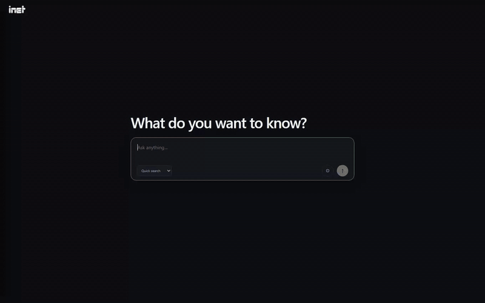
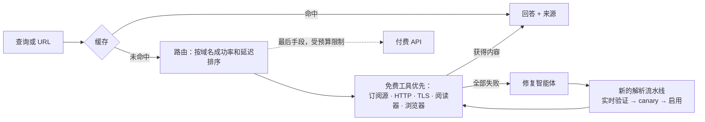
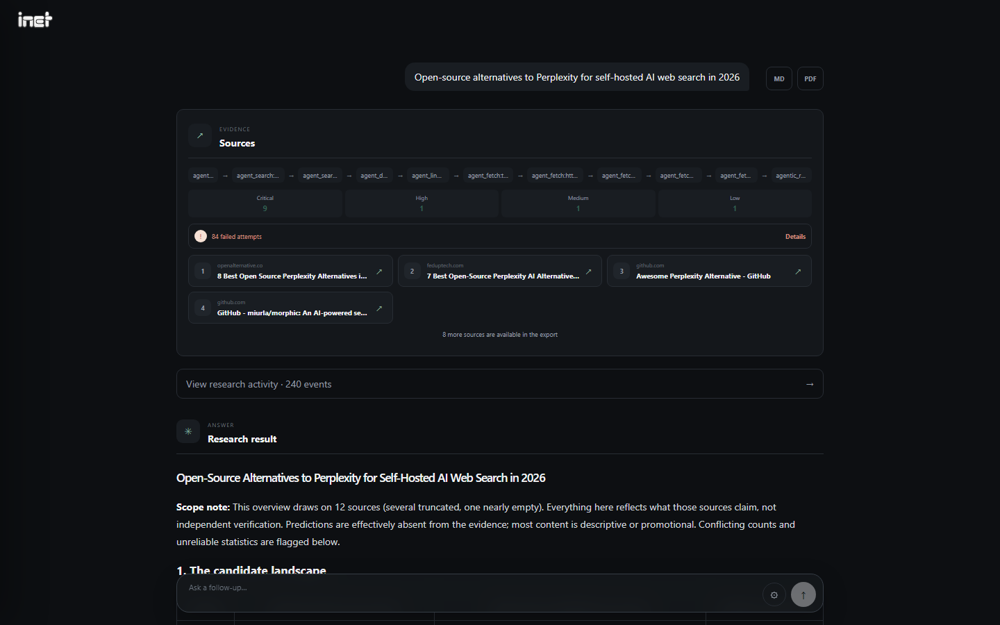
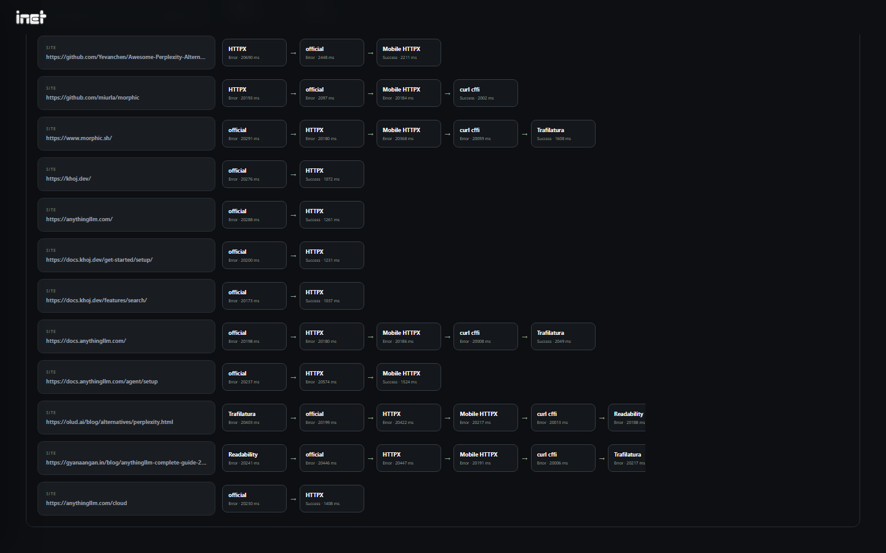
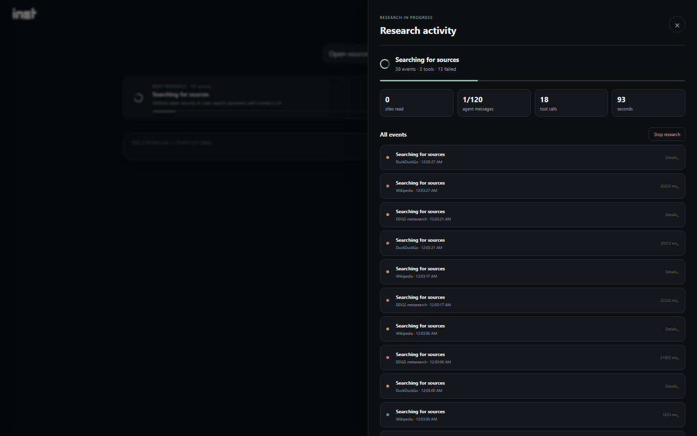
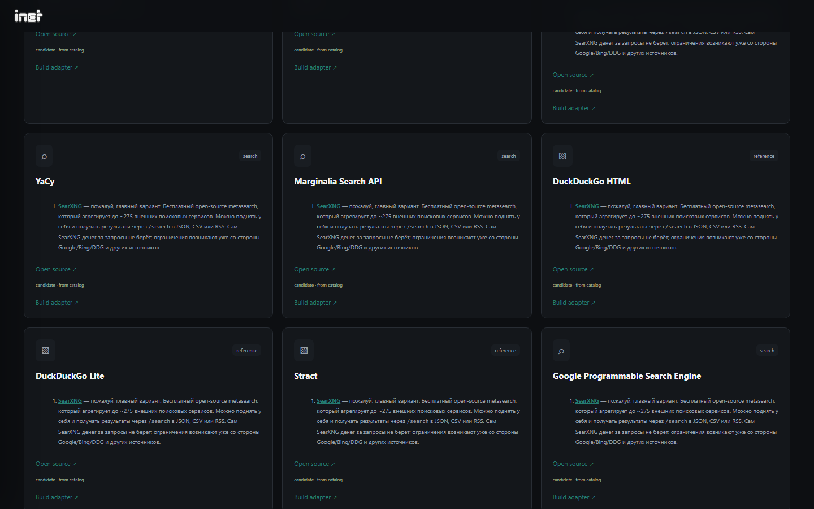

<div align="center">


# INET

**免费优先、可自我修复的网络研究引擎，面向人和 AI 智能体。**
可自托管，替代付费的搜索与抓取 API（Tavily、Firecrawl、Perplexity API）。

[English](README.md) · [Русский](README.ru.md) · **简体中文**

[](https://github.com/JGSnapp/inet/actions/workflows/ci.yml)
[](LICENSE)




<sub>深度研究：12 分钟压缩为 40 秒 · [MP4](docs/assets/demo.mp4)</sub>

</div>

## 它能做什么

输入问题或粘贴 URL，INET 会搜索、读取网页，并给出带引用的回答。它**优先使用免费来源**：公共搜索引擎、
官方订阅源和 API、普通 HTTP、带浏览器 TLS 指纹的 HTTP、阅读器服务和无头浏览器。付费 API 只作为最后的
后备，并且不会超出你设定的预算。

遇到读不了的网站时，INET 会记录原因并尝试下一种方法，然后为该域名设计新的解析流水线，在真实页面上测试，
只有测试通过才会保留。

- **搜索、读取、深度研究。** 快速搜索只需几秒。深度研究模式下，智能体会自己规划查询、挑选来源、读取数十个网站，
  再写出带来源的报告。
- **带记忆的免费优先路由。** 工具按每个域名的成功率和延迟排序。缓存和原子化的配额预留保证同一个请求不会付费两次。
- **自我修复。** 失败的来源会得到带版本的修复流水线：实时验证、灰度（canary）上线、自动回滚。
- **透明。** 路由图显示每个查询和 URL 调用过的每个工具，以及耗时和错误。
- **易于集成。** 提供 MCP 服务器（Claude Code、Cursor、Cline）、Python SDK、LangChain 工具、命令行，
  以及兼容 Tavily 和 Firecrawl 的接口。
- **可用任意 LLM，也可以不用。** 不配置模型也能搜索和读取网页。生成回答可以用 Ollama、任意 OpenAI 兼容接口，
  或 OpenAI、Claude、Gemini、Groq、DeepSeek。
- **英文和俄文界面。** 事件、错误和导出使用界面语言；回答使用提问所用的语言。
- **安全设计。** 生成的代码只在受限的 Docker 沙箱中运行。启用 SSRF 防护，密钥加密存储，所有端口只绑定 localhost。

## 快速开始

**Linux / macOS**

```bash
curl -fsSL https://raw.githubusercontent.com/JGSnapp/inet/main/install.sh | sh
cd ~/inet && ./inet setup && ./inet serve --open
```

**Windows（PowerShell）**

```powershell
irm https://raw.githubusercontent.com/JGSnapp/inet/main/install.ps1 | iex
cd ~\inet; .\inet setup; .\inet serve --open
```

安装脚本会通过 [uv](https://docs.astral.sh/uv/) 自带 Python，无需事先安装任何东西。`inet setup` 会询问要使用哪个 LLM，
也可以跳过。打开 http://127.0.0.1:8000 使用界面，API 文档在 http://127.0.0.1:8000/docs。

<details>
<summary><b>Docker Compose</b>（包含适配器沙箱的完整部署）</summary>

```bash
git clone https://github.com/JGSnapp/inet && cd inet
cp .env.example .env        # 设置 ENABLE_LLM / AI_* 以及随机的 SANDBOX_TOKEN
docker compose up --build
```

界面地址为 http://localhost:8501，API 地址为 http://localhost:8000。如果 Ollama 运行在宿主机上，请设置
`OLLAMA_BASE_URL=http://host.docker.internal:11434`。
</details>

## 使用方式

### 命令行

```bash
inet search "free-threaded Python 3.14 status"
inet fetch https://peps.python.org/pep-0703/
inet ask "SQLite vs DuckDB for analytics" --deep
inet doctor                       # 检查依赖和 LLM 连接
```

如果服务器还没运行，`search`、`fetch` 和 `ask` 会在后台自动启动它。

### MCP：Claude Code、Claude Desktop、Cursor、Cline、Windsurf

提供三个工具：`web_search`、`fetch_url` 和 `research`（设置 `deep=true` 可生成多站点报告）。

```bash
claude mcp add inet -- ~/inet/inet mcp               # Claude Code（Windows：C:\Users\you\inet\inet.cmd mcp）
```

```json
{
  "mcpServers": {
    "inet": { "command": "/home/you/inet/inet", "args": ["mcp"] }
  }
}
```

如果 INET 运行在 Docker 或其他机器上，请改用独立客户端：

```json
{
  "mcpServers": {
    "inet": {
      "command": "uvx",
      "args": ["--from", "inet-client[mcp] @ git+https://github.com/JGSnapp/inet#subdirectory=sdk/python", "inet-mcp"],
      "env": { "INET_URL": "http://127.0.0.1:8000" }
    }
  }
}
```

### Python SDK 与 LangChain

```bash
pip install "inet-client[langchain] @ git+https://github.com/JGSnapp/inet#subdirectory=sdk/python"
```

```python
from inet_client import Inet

with Inet() as inet:                                  # $INET_URL 或 http://127.0.0.1:8000
    hits = inet.search("vector databases benchmark 2026")["sources"]
    page = inet.fetch("https://example.com")["content"]
    report = inet.research("Open-source Perplexity alternatives", deep=True)["answer"]

from inet_client.langchain import inet_tools          # web_search, fetch_url, research
agent = create_react_agent(model, inet_tools())
```

### 替换 Tavily 或 Firecrawl

把现有客户端的地址指向 INET 即可。客户端发送的 API 密钥会被接收并忽略。

| 接口 | 兼容对象 |
| --- | --- |
| `POST /tavily/search` | Tavily `/search`（`query`、`max_results`、`include_answer`） |
| `POST /firecrawl/v1/scrape` | Firecrawl `/v1/scrape`（markdown） |
| `POST /api/search`、`/api/fetch`、`/api/research` | 简单的同步 JSON API |
| `POST /api/runs` + `GET /api/runs/{id}` | 带完整事件追踪的异步任务 |

## 工作原理



**坚持程度**（1–4）决定每个来源最多尝试多少种方法。第 4 级会尝试所有可用方法，然后设计新的流水线。
**反思**在回答显示之后运行：它复盘失败、测试替代方案，只保留通过实时验证的改进。

| 深度研究回答 | 路由图：每个查询和 URL 的所有工具调用 |
| --- | --- |
|  |  |
| **实时智能体活动** | **免费工具目录** |
|  |  |

更多细节见[架构文档](docs/architecture.md)（俄文）。

## 内置工具

| 阶段 | 工具 |
| --- | --- |
| 搜索 | DuckDuckGo、DDGS 元搜索、Wikipedia、SearXNG（自建或在 Docker 中自动启动）、Tavily（可选） |
| 读取 | 官方 RSS/Atom/JSON/JSON-LD、HTTPX（桌面与移动端）、带浏览器 TLS 的 curl_cffi、Trafilatura、Readability、Jina Reader、Playwright、浏览器智能体、Wayback（需开启）、Firecrawl（可选） |
| 自我修复 | 声明式解析流水线、API 发现、在沙箱中用 20 个样例和 20 个真实网站测试的生成适配器 |
| 运维 | 配额预算、429/503 冷却、代理发现与验证、定时抓取并导出 JSON/CSV |

[工具目录](backend/resources.json)收录了 112 个免费或有免费额度的工具，并注明来源。只有在许可证、费用和实际表现
都核实之后，工具才会被启用。

## 负责任地使用

INET 只读取**公开**信息。它不会绕过登录、付费墙或网站条款，也不会把验证码页面或错误页面当作内容返回。
验证码识别服务和代理是需要你自行配置的可选集成。INET 设计为本地单用户服务，未加认证时请勿暴露到公网。
详见 [SECURITY.md](SECURITY.md)。

## 参与贡献

欢迎提交问题报告、INET 无法读取的网站、新的免费工具和翻译。请参阅 [CONTRIBUTING.md](CONTRIBUTING.md)。

## 许可证

[MIT](LICENSE)
