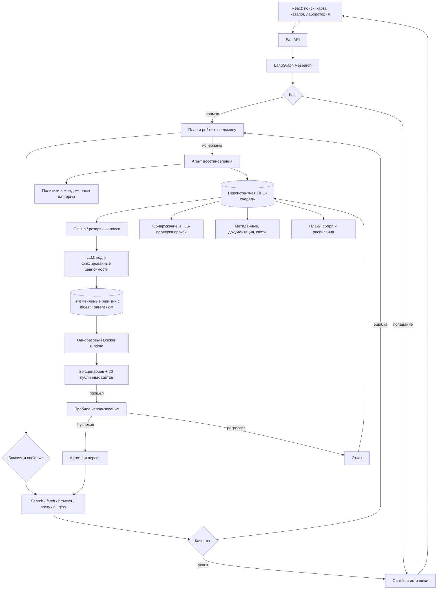

# Архитектура INET

## Рабочий и развивающий контуры

`Research` — LangGraph с типизированным состоянием, контрольными точками и условными переходами. `Automation` — отдельный долгоживущий worker с собственным LangGraph-исполнением заданий. Очередь восстановления запросов сериализуется независимо от FIFO обслуживания инструментов. Модель работает внутри заданных контрактов `RecoveryDecision`, `AdapterSpec`, `BrowserAction`; бюджет и продвижение контролирует код.

## Универсальный repair-loop источника

После исчерпания обычного fetch-маршрута агент инспектирует исходный URL без исполнения кода страницы. Он обнаруживает `alternate` feeds, JSON endpoints, OpenAPI/API-ссылки и JSON-LD, затем создаёт `ParsingPipelineSpec` с максимум восемью ограниченными этапами. Разрешены только декларативные JSON paths, CSS selectors и наблюдавшиеся URL; сгенерированный код, секреты, формы и авторизация в pipeline отсутствуют.

Порядок по умолчанию: проверенный JSON API или feed, JSON-LD, semantic HTML (`main`, `article`, `role=main`) и браузер. Каждый этап сохраняет latency и нормализованную причину ошибки: access/auth, rate limit, anti-bot, selector drift, format change, timeout либо transport/parser. Первый качественный результат завершает цепочку.

Ревизия неизменяема и имеет digest/parent. До live-выполнения она не может стать активной. Успешная версия становится canary; повторные runtime-ошибки откатывают предыдущий указатель и ставят `pipeline_repair` в персистентную очередь. Ремонт повторно инспектирует источник и при доступной модели может изменить только контрактные URL/paths/selectors, после чего снова проходит gate.

API discovery отделяет факты от маркетинговых заявлений. `verified_unauthenticated` означает только успешный структурированный HTTP-ответ при реальном запросе без ключа. `no_charge_observed_not_guaranteed` не является обещанием тарифа; лицензия остаётся `unverified`, пока не получено отдельное доказательство. Rate-limit headers, digest ответа, документация и время проверки сохраняются. Перед автоматическим включением endpoint в pipeline дополнительно проверяется связь ответа с исходной страницей; доступный, но нерелевантный JSON остаётся только кандидатом.

Для кандидата без авторизации модель может предложить `ConnectorSpec`: HTTP-метод, query/static parameters и отображение JSON-полей. Код не генерируется. Endpoint заменяется кодом на фактически проверенный URL, параметры с именами секретов запрещены, connector создаётся выключенным. Только успешный реальный запрос, непустые нормализованные sources и прохождение выходного контракта переводят его в `enabled`; неудачная схема удаляется и может быть исправлена не более двух раз.

Планировщик периодически запускает `pipeline_monitor` и `api_monitor`. Первый исполняет сохранённый probe URL, обновляет canary-наблюдения и ставит repair после дрейфа. Второй заново проверяет формат, digest и rate-limit headers API; две последовательные ошибки переводят кандидата в `degraded`.

Основные модули: `research.py`, `automation.py`, `registry.py`, `evaluation.py`, `providers.py`, `extended_providers.py`, `proxies.py`, `vault.py`, `captcha.py`. `api.py` управляет lifecycle. Документный шаблон `agent.py`, `database.py`, `tools.py`, `db/` сохранён, но текущий веб-runtime его не вызывает.

## Разработка и продвижение

Discovery сначала использует GitHub API, при ошибке — рабочие поисковые адаптеры. Кандидат хранит источник, метаданные, лицензию и дату проверки. Разработчик получает README и commit исходного репозитория; пишет обёртку выбранного инструмента с контрактом `run(query, limit)` и фиксированными PyPI-зависимостями. Изменения сохраняются как новые ревизии; старый код не перезаписывается.

Песочница устанавливает зависимости и выполняет набор запросов. Для fetch отдельно проверяются 20 локальных сценариев и 20 публичных сайтов; каждая группа должна дать минимум 80%. Пустые страницы, CAPTCHA и HTTP-ошибки являются отрицательными эталонами и не должны выглядеть успешными. Для search используются 20 эталонных тематических запросов. Отчёт привязан к digest версии. После неудачи модель может создать ещё две исправленные ревизии.

Продвижение без подходящего отчёта запрещено. Canary становится активной после пяти успешных реальных вызовов. Две ошибки на canary или три ошибки в последних пяти вызовах активной версии вызывают откат. Уведомление об откате становится заданием исправления. Новая успешная версия может повторно запустить неразрешённые кейсы; число таких попыток ограничено.

## Изоляция

Backend не выполняет сгенерированный Python. Он отправляет спецификацию доверенному sandbox service. Только этот сервис имеет Docker socket; caller не может задавать image, mounts, network, privileges или environment контейнера.

Runtime: uid 1000, read-only root, `cap_drop=ALL`, `no-new-privileges`, 1 CPU, 1 ГБ RAM, 128 PID, tmpfs и внешний предел времени через `timeout`. Таймаут действует даже после потери worker. В runtime нет ключей, мастер-ключа, БД и папок пользователя. Возвращаемые данные проходят проверку контракта и качества.

Внутренняя Docker-сеть не имеет прямого выхода наружу. Egress proxy разрешает только порты 80/443, проверяет все DNS-адреса и соединяется с проверенным IP. Единственное внутреннее исключение — эталонный сервер `fixtures:8081`. Служебные адреса и приватные сети блокируются. Зависимости, не умеющие работать через HTTP(S)-proxy, не смогут обратиться в интернет и не пройдут испытания.

Sandbox service — доверенная инфраструктура с доступом к Docker daemon. Он не является средством безопасного публичного хостинга чужих заданий без аутентификации и внешнего hardening. Поставляемый Compose предназначен для локальной работы.

## Управляемые инструменты

Адаптер может содержать `ManagedServiceSpec` для инструмента, которому нужен постоянный процесс: поискового движка, базы, индекса, конвертера или другого HTTP-сервиса. Спецификация задаёт образ с явным тегом или digest, порт, health-check, конфигурационные файлы, каталоги данных и пределы CPU/RAM/PID. Секреты в декларации запрещены.

Sandbox control plane — единственный компонент с Docker socket. Он создаёт контейнер без публикации портов и host mounts, с `read_only`, `cap_drop=ALL`, `no-new-privileges`, ограниченными tmpfs и логами. Инструмент и одноразовый адаптер находятся во внутренней сети `inet-sandbox`; наружу они выходят только через egress proxy. После первого pull сохраняется фактический digest образа.

Watchdog каждые 20 секунд проверяет процесс и HTTP health endpoint. После трёх неудачных проверок сервис перезапускается. Backend раз в минуту синхронизирует статус, CPU, RAM и число перезапусков. Оператор и агент могут выполнить ensure, restart и stop через аутентифицированный sandbox API; произвольные параметры Docker, mounts, privileges и сокет вызывающей стороне не доступны.

При исчерпании поисковых адаптеров recovery сначала разворачивает управляемый SearXNG и повторяет тот же запрос. Для других кандидатов LLM генерирует совместно адаптер и декларацию сервиса; сервис автоматически поднимается перед изолированными тестами и перед каждым рабочим вызовом, если он был остановлен.

## Редактируемые workspace’ы

Исходники и конфигурации управляемых проектов находятся в именованных Docker volumes `inet-project-*`. Control plane разрешает только относительные нормализованные пути и ограниченные операции: список файлов, чтение до 1 МБ, записи/удаления, unified diff, snapshot, rollback и argv-команду. Произвольные host paths не принимаются. Публичный Git-источник должен использовать HTTPS без встроенных credentials; checkout выполняется через контролируемый egress.

Команды проекта запускаются в заявленном tagged/digest runtime image с read-only root, `cap_drop=ALL`, `no-new-privileges`, отдельными лимитами CPU/RAM/PID и единственным RW mount проекта. Shell не добавляется control plane: команда задаётся массивом argv. Сеть выключена по умолчанию; явное включение подключает контейнер только к внутренней сети с egress proxy. Docker socket, backend runtime, секреты и пользовательские каталоги не монтируются.

`workspace_repair` выбирает ограниченный набор текстовых файлов, получает структурированный план правки, делает snapshot, применяет изменение и запускает declared tests. Любой non-zero exit вызывает rollback. Успешная правка связанного сервиса приводит к restart и повторному readiness-check; ошибка запуска также откатывает snapshot и возвращает прежний сервис. Конфигурационные blobs при provisioning автоматически становятся workspace-проектом, поэтому агент может исправлять файлы уже используемого движка.

## Политики, память, квоты

Рейтинг использует успешность и задержку последних 30 наблюдений по домену; без доменной истории применяются последние 100 общих наблюдений адаптера. Политика домена хранит таймаут, селектор ожидания, порог длины, маркеры блокировки, предпочтения, официальные URL и CSS-экстракторы. Изменения версионируются. Агент получает похожие ошибки домена и агрегированные паттерны нескольких доменов.

Локальные квоты резервируются атомарно до обращения, включая повторы и стоимость операции. Firecrawl сверяет остаток с credit-usage API; пользовательские коннекторы задают свой usage endpoint и JSON-path остатка. Свежий удалённый нулевой остаток исключает ступень. 429/503 включают cooldown с учётом Retry-After. Ошибочное обращение может быть оплачено внешним сервисом и не возвращается в локальный бюджет автоматически.

Для API-документации сохраняются источник, дата и digest; изменения видны в журнале. Сведения каталога не превращаются в подтверждённые тарифы без источника.

## Браузер и CAPTCHA

Playwright проверяет публичность адресов, отключает service workers и загрузки файлов. Агент ограничен восемью действиями и текущим доменом; формы, покупки и авторизации не исполняются. Обычное ожидание селектора работает без LLM. Встроенный браузерный агент — собственная реализация на Playwright, аналогичная по роли Browser Use; зависимость Browser Use не обязательна.

CapSolver/2Captcha подключаются только при наличии ключа. Поддержаны распознаваемые виджеты Turnstile и reCAPTCHA v2 с sitekey; создаётся задача, опрашивается результат, заполняется поле ответа и вызывается объявленный callback. Неизвестные/неподдержанные проверки приводят к следующей стратегии или диагностическому кейсу, а не к заявлению об успешном доступе. Решение CAPTCHA учитывается в отдельном бюджете.

## Состояние, очередь и границы

SQLite/WAL хранит runs, события, кэш, бюджеты, наблюдения и сущности control plane. LangGraph checkpoint хранится в отдельном SQLite-файле. Задания после перезапуска возвращаются в очередь; незавершённые запросы помечаются `interrupted` и возобновляются через API/UI.

Исполнение не exactly-once: авария после отправки HTTP-запроса и до checkpoint может привести к повторному обращению. Дедупликация и семафоры локальны процессу. Используйте один Uvicorn worker. Предельное число активных/ожидающих runs — 50, параллельных графов — четыре. `RUN_TIMEOUT` по умолчанию 900 секунд после получения слота. Подготовка новых инструментов продолжается отдельными заданиями.

У встроенного HTTP-клиента есть проверка публичных адресов и редиректов, лимит 2 МБ и запрет редиректов запросов с аутентификацией. Эти проверки не эквивалентны изоляции встроенного браузера на уровне сети: для публичного многопользовательского развёртывания нужен отдельный egress-периметр и для backend. Ключи шифруются Fernet и не возвращаются UI, но локальная БД содержит запросы и извлечённые данные.

## Документация интеграций

- [LangGraph Graph API](https://docs.langchain.com/oss/python/langgraph/graph-api) и [custom workflow](https://docs.langchain.com/oss/python/langchain/multi-agent/custom-workflow).
- [Docker SDK: containers](https://docker-py.readthedocs.io/en/stable/containers.html).
- [SearXNG Search API](https://github.com/searxng/searxng/blob/master/docs/dev/search_api.rst).
- [Tavily Search](https://docs.tavily.com/documentation/api-reference/endpoint/search).
- [Firecrawl credit usage](https://docs.firecrawl.dev/api-reference/endpoint/credit-usage).
- [CapSolver Turnstile](https://docs.capsolver.com/en/guide/captcha/cloudflare_turnstile/) и [2Captcha Turnstile](https://2captcha.com/api-docs/cloudflare-turnstile).
